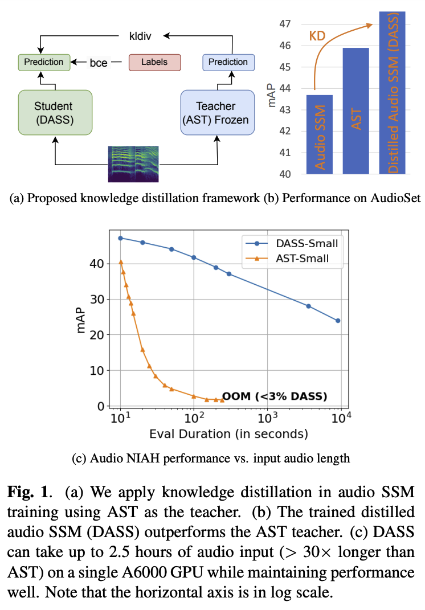

# DASS: Distilled Audio State Space Models Are Stronger and More Duration-Scalable Learners

## Introduction  
[](https://huggingface.co/saurabhati/DASS_small_AudioSet_48.9) [](https://arxiv.org/pdf/2407.04082) [](https://github.com/Saurabhbhati/DASS/releases)

**Update:**
- **DASSv3:** DASS model distilled from SSLAM model. New performance: DASS small (30M) mAP: 50.1 and DASS medium (49M) mAP: 50.2.
- **DASSv2:** We have recently added DASS model distilled from an ensemble of AST and HTS-AT which sigificantly boosts the performance of DASS. New performance: DASS small (30M) mAP: 48.6 and DASS medium (49M) mAP: 48.9.

<p align="center">
  
</p>

This repository contains cleaned up (ongoing) code (in PyTorch) for **DASS** model proposed in the SLT 2024 (accepted) [DASS: Distilled Audio State Space Models Are Stronger and More Duration-Scalable Learners](https://arxiv.org/pdf/2407.04082) (Saurabhchand Bhati, Yuan Gong, Leonid Karlinsky, Hilde Kuehne, Rogerio Feris, James Glass).

DASS is the first state-space model that outperforms transformer-based audio classifiers such as AST, HTS-AT, and Audio-MAE. We use the AudioSet dataset for training and evaluation, where DASS achieves a new state-of-the-art mAP of 47.6 on AudioSet. We use knowledge distillation (KD) from a transformer based model, AST, to train the model as shown in Fig 1(a). KD is an integral part of DASS, helping DASS outperform the AST teacher, Fig 1(b). 

|                                           | Params | Pretrain |  mAP |
|-------------------------------------------|:------:|:--------:|:----:|
| Transformer based models                                             |
| [AST](https://arxiv.org/pdf/2104.01778)                 |   87M  |   IN SL  | 45.9 |
| [HTS-AT](https://arxiv.org/pdf/2202.00874)              |   31M  |   IN SL  | 47.1 |
| [PaSST](https://arxiv.org/pdf/2110.05069)         |        |   IN SL  | 47.1 |
| [Audio-MAE](https://arxiv.org/pdf/2207.06405)           |   86M  |    SSL   | 47.3 |
| [BEATS_iter3](https://arxiv.org/pdf/2212.09058)         | 90M | AS SSL | 48.0 |
| [EAT](https://arxiv.org/pdf/2401.03497v1)               | 88M |  AS SSL | 48.6 |
| [SSLAM](https://openreview.net/pdf?id=odU59TxdiB)       | 88M |  AS SSL | 50.2 |
| Concurrent SSM models                     |        |          |      |
| [AuM](https://arxiv.org/pdf/2406.03344)               |   26M  |   IN SL  | 39.7 |
| [Audio Mamba](https://arxiv.org/pdf/2405.13636)         |   40M  |   IN SL  | 44.0 |
| DASS-Small                                 |   30M  |   IN SL  | 47.2 |
| DASS-Medium                                |   49M  |   IN SL  | 47.6 |
| DASS-Small (teach: AST + HTS-AT)           |   30M  |   IN SL  | 48.6 |
| DASS-Medium (teach: AST + HTS-AT)          |   49M  |   IN SL  | 48.9 |
| DASS-Small (teach: SSLAM)                  |   30M  |   IN SL  | 50.1 |
| DASS-Medium (teach: SSLAM)                 |   49M  |   IN SL  | 50.2 |


The DASS model file is in `src/models/ast_models.py`, the recipes are in `egs/audioset/run.sh`, when you run `run.sh`, it will call `/src/run.py`, which will then call `/src/dataloader.py` and `/src/traintest.py`, which will then call `/src/models/ast_models.py`.

## Getting Started  

Step 1. Clone or download this repository and set it as the working directory, create a virtual environment and install the dependencies. The list of packages is in requirements.txt. For reference, the output of the pip freeze for the original environment is stored in pip_freeze.txt.

```
cd DASS/
conda create -n DASS 
conda activate DASS
pip install -r requirements.txt 
conda install cuda=12.1 -c nvidia # only required if cuda is not installed 
pip install -r requirements.txt 
cd kernels/selective_scan && pip install .
```

Step 2. Inference from the DASS model 

```python
import torchaudio
import torch 
from models.ast_models import DASS

def make_features(wav_name, mel_bins, target_length=1024):
    waveform, sr = torchaudio.load(wav_name)
    waveform = waveform - waveform.mean()
    fbank = torchaudio.compliance.kaldi.fbank(
        waveform, htk_compat=True, sample_frequency=sr, use_energy=False,
        window_type='hanning', num_mel_bins=mel_bins, dither=0.0,
        frame_shift=10)
    #
    n_frames = fbank.shape[0]
    p = target_length - n_frames
    if p > 0:
        m = torch.nn.ZeroPad2d((0, 0, 0, p))
        fbank = m(fbank)
    elif p < 0:
        fbank = fbank[0:target_length, :]
    #
    fbank = (fbank - (-4.2677393)) / (4.5689974 * 2)
    return fbank

audio_input = make_features('../babble_all.wav',128).unsqueeze(0)    #path to an audio file

audio_model = DASS(label_dim=527, imagenet_pretrain=False,
                    audioset_pretrain=False, model_size='small')

if not isinstance(audio_model, torch.nn.DataParallel):
    audio_model = torch.nn.DataParallel(audio_model).eval()

audio_model = audio_model.cuda()
audio_model.load_state_dict(torch.load('../pretrained_models/DASS_small.pth'), strict=True)

audio_output = audio_model(audio_input.cuda())

```

## Training
The repository follows the training recipe from AST. Please follow the AST repository for detailed instruction on data preparation. 

```
cd egs/audioset

model=DASS
model_size=small                                # small or medium
set=balanced                                    # balanced or full
imagenetpretrain=True                           # use imagenet pretrained model
knowledge_distillation=True                     # use AST as the teacher model 
dist_loss_type=kldiv                            # KD loss type kldiv, cosine etc.
lr=1e-4                                         # learning rate 
bash ./run.sh ${model} ${model_size} ${set} ${imagenetpretrain} ${knowledge_distillation} ${dist_loss_type} ${lr}

```

## NIAH: Needle in the Audio Haystack 

State-space models scale linearly with sequence length. Recent attempts have shown that state-space audio models require less memory and enjoy faster inference than transformer-based models. However, these models do not measure performance for longer input utterances ([AuM](https://arxiv.org/pdf/2406.03344), [Audio Mamba](https://arxiv.org/pdf/2405.13636)).  

To measure the performance at various lengths, we design a Needle In Audio Haystack (NIAH) task. In NIAH, we randomly put the 10-second needle in a randomly generated haystack of various lengths. The haystack could be zeros or fbank extracted from noise at various SNRs. The DASS model does not require any positional embeddings so it can easily applied to inputs of variable lengths. As seen in the figure above, DASS is significantly more duration robust than AST. DASS retains approximately half the performance even at 2.5 hours of haystack duration, Figure 1(c).

The main file for running NIAH is in `src/run_NIAH.py` which calls `src/dataloader_niah.py` for generating the haystack and fbank features for both needle and haystack. 

```
model_size=small                                # small or medium
ckpt=../pretrained_models/DASS_small.pth        # path to the checkpoint to run NIAH on
input_max_len=5000                              # length of the haystack, 1000 features for 10 seconds
audio_insert_tstep=0.5                          # relative needle location, between 0, 1. 0: begining, 0.5: middle, 1: end 
niah_use_noise=False                            # use noise to construct the haystack, if False haystack is made from zeros
niah_noise_snr=10                               # SNR of the noise used for constructing noisy haystack, only used if niah_use_noise=True
niah_noise_type=white                           # white for Gaussian noise, babble for babble noise, only used if niah_use_noise=True 
python run_NIAH.py --model_size ${model_size} -ckpt ${ckpt} --input_max_len ${input_max_len} --audio_insert_tstep ${audio_insert_tstep}
```

## Acknowledgment

This project is based on AST([paper](https://arxiv.org/pdf/2104.01778), [code](https://github.com/YuanGongND/ast/tree/master)), VMamba([paper](https://arxiv.org/pdf/2401.10166), [code](https://github.com/MzeroMiko/VMamba/tree/main)) thanks for their excellant works. Please make sure to check them out.  

## Citation

```bibtex
@article{bhati2024dass,
  title={DASS: Distilled Audio State Space Models Are Stronger and More Duration-Scalable Learners},
  author={Bhati, Saurabhchand and Gong, Yuan and Karlinsky, Leonid and Kuehne, Hilde and Feris, Rogerio and Glass, James},
  journal={arXiv preprint arXiv:2407.04082},
  year={2024}
}
```
